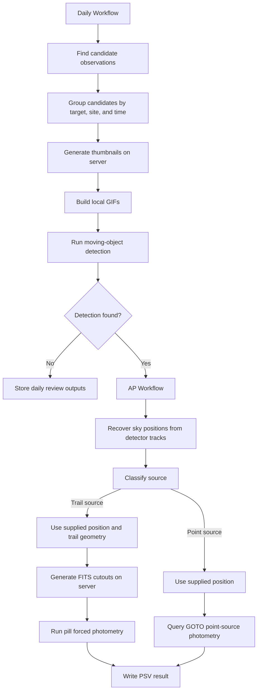

# Pipeline Workflow

This project runs a daily asteroid candidate pipeline. The daily workflow finds candidate observations, groups them by target, site, and time, generates server-side thumbnails, builds local GIFs, and runs moving-object detection. Detected candidates are passed to the AP workflow, which recovers sky positions from detector tracks, classifies each source, and then routes trail sources to pill forced photometry or point sources to GOTO point-source photometry. The final AP output is a PSV result file.

